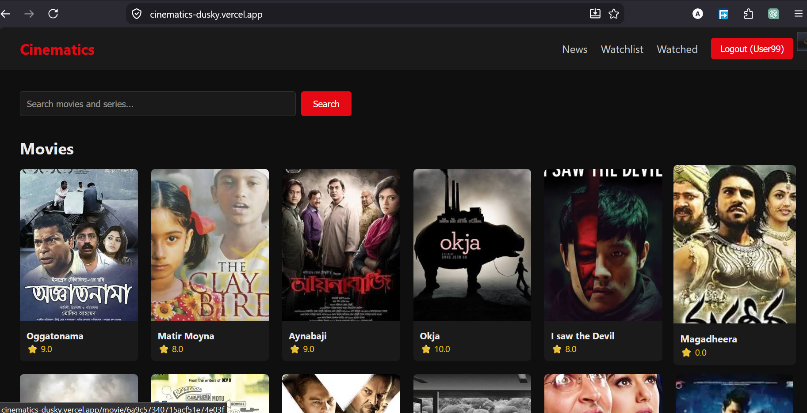
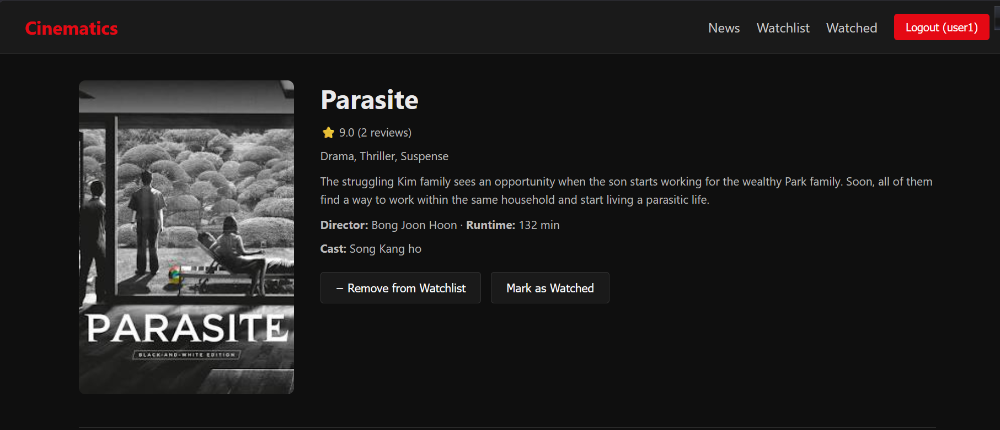
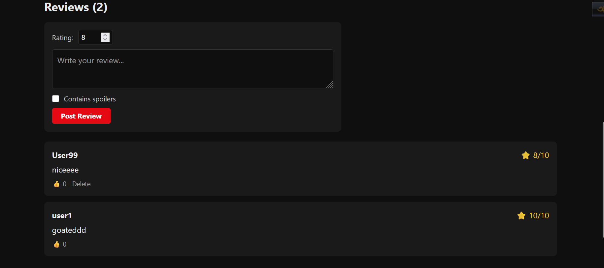
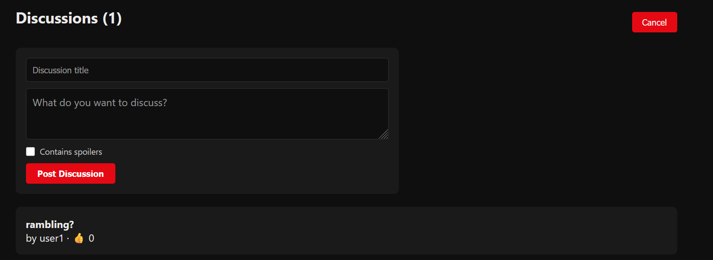
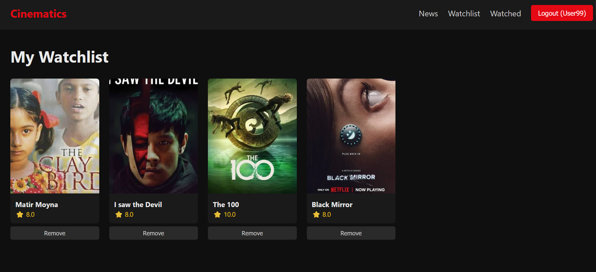
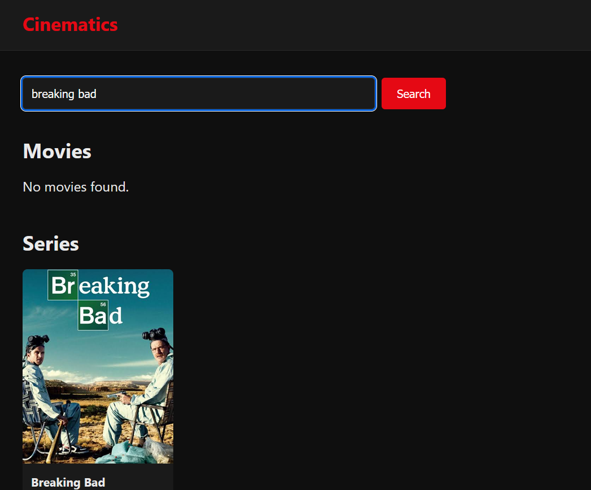
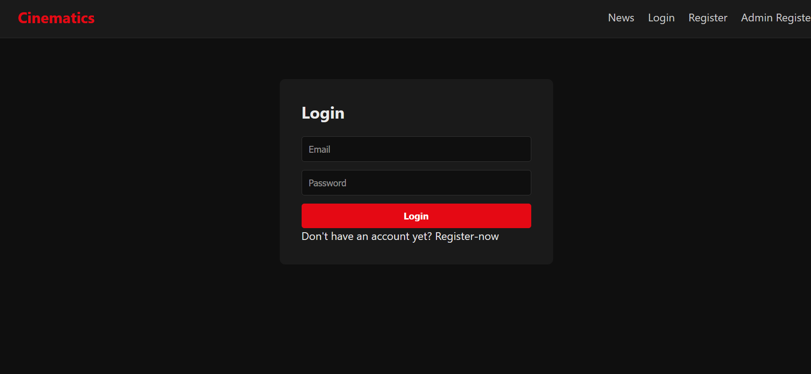

# 🎬 Cinematics — MERN Cinema Review Platform

A full-stack, IMDb-style platform where movie and series lovers can rate, review, and discuss their favorite titles — built end-to-end with the MERN stack.

🔗 **Live Demo:** [cinematics-dusky.vercel.app](https://cinematics-dusky.vercel.app)
💻 **Tech Stack:** MongoDB · Express.js · React · Node.js

---

## 📌 Overview

Cinematics goes beyond a simple rating app — it's a community platform where users can browse movies/series, write reviews, start threaded discussions (with nested replies), track what they want to watch vs. what they've already watched, and stay updated through a dedicated news section. Admins get a full dashboard to manage all content.

---

## ✨ Features

### For Users
- 🔐 **Secure Authentication** — JWT-based login/register with httpOnly cookies
- 🎥 **Browse & Search** — Search and filter movies/series by genre, rating, and release date
- ⭐ **Reviews & Ratings** — Rate titles (1–10) and write detailed reviews, with like support
- 💬 **Threaded Discussions** — Reddit-style discussion boards per title, with nested comment replies and spoiler tags
- 📌 **Watchlist** — Save titles you want to watch
- ✅ **Watched List** — Track what you've already seen, separate from your watchlist
- 📰 **News Section** — Browse news on upcoming releases, actors, and directors, filterable by category

### For Admins
- 🛠️ **Admin Dashboard** — Centralized panel with content stats
- 🎬 **Movie & Series Management** — Full CRUD for movies and series
- 📰 **News Management** — Publish and manage news articles, optionally linked to a movie/series
- 🖼️ **Image Uploads** — Direct image upload via Cloudinary for posters, banners, and news covers

---

## 🖼️ Screenshots

### Home Page


### Movie Detail Page


### Reviews Section


### Discussion Thread with Nested Replies


### Watchlist


### Search


### Login


### Regristration


---

## 🏗️ Tech Stack

**Frontend**
- React (Vite)
- React Router DOM
- Axios
- Context API for auth state

**Backend**
- Node.js + Express.js
- MongoDB + Mongoose
- JWT authentication (httpOnly cookies)
- bcrypt.js for password hashing
- Multer + Cloudinary for image uploads

**Deployment**
- Frontend → Vercel
- Backend → Render
- Database → MongoDB Atlas
- Images → Cloudinary

---

## 📂 Project Structure

```
CinematicsMERN/
├── backend/
│   ├── config/          # DB & Cloudinary config
│   ├── controllers/      # Route logic
│   ├── middleware/       # Auth, upload, error handling
│   ├── models/           # Mongoose schemas
│   ├── routes/           # Express routes
│   ├── utils/             # Helper functions
│   └── server.js
└── frontend/
    ├── src/
    │   ├── api/           # Axios instance
    │   ├── components/    # Reusable UI components
    │   ├── context/       # Auth context
    │   ├── pages/         # Route-level pages
    │   └── utils/          # Helper functions
    └── vercel.json
```

---

## 🚀 Getting Started (Local Setup)

### Prerequisites
- Node.js (v18+)
- MongoDB Atlas account
- Cloudinary account

### 1. Clone the repo
```bash
git clone https://github.com/Hossain-Altaf/Cinematics-MERN-stack-platform.git
cd Cinematics-MERN-stack-platform
```

### 2. Backend setup
```bash
cd backend
npm install
```

Create a `.env` file in `backend/`:
```
PORT=5000
MONGO_URI=your_mongodb_atlas_connection_string
JWT_SECRET=your_jwt_secret
ADMIN_SECRET=your_admin_secret
CLOUDINARY_CLOUD_NAME=your_cloud_name
CLOUDINARY_API_KEY=your_api_key
CLOUDINARY_API_SECRET=your_api_secret
CLIENT_URL=http://localhost:5173
NODE_ENV=development
```

```bash
npm run dev
```

### 3. Frontend setup
```bash
cd ../frontend
npm install
```

Create a `.env` file in `frontend/`:
```
VITE_API_URL=http://localhost:5000/api
```

```bash
npm run dev
```

The app will be running at `http://localhost:5173`, with the API at `http://localhost:5000`.

---

## 👤 Author

**Altaf Hossain**
Computer Science Student, Shahjalal University of Science and Technology (SUST)

---

